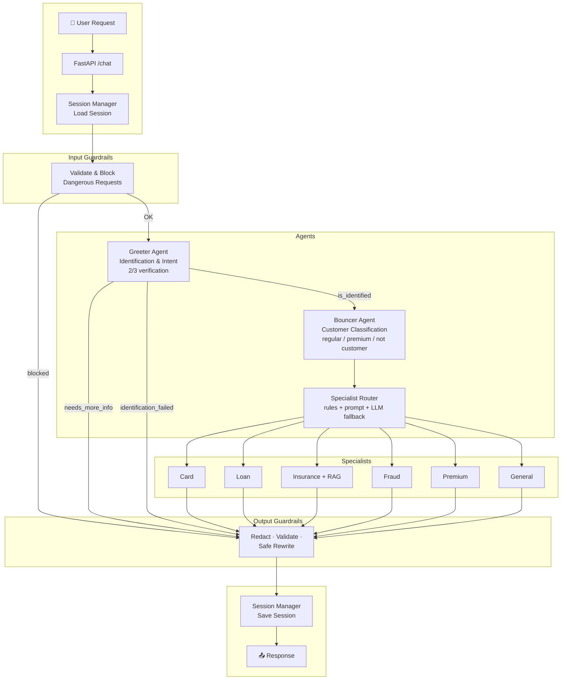
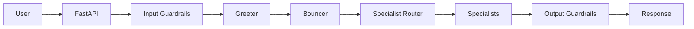
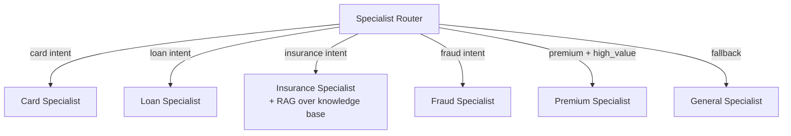
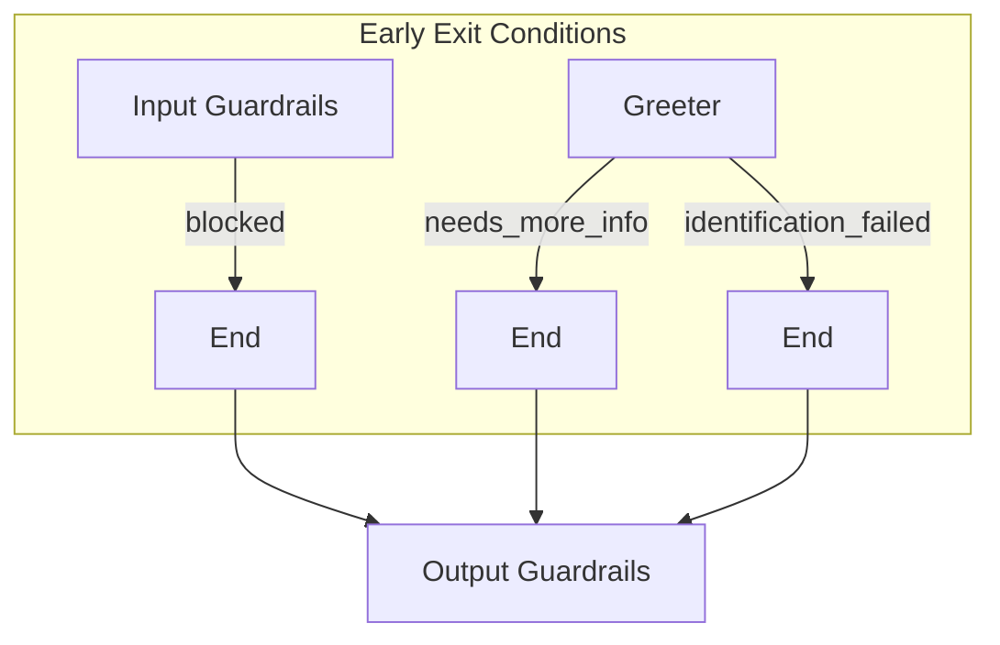

# 🏗️ Architecture Diagram

Visual representation of the Multi-Agent Banking Support system flow.

---

## System Flow

---

## Simplified High-Level View

---

## Routing Logic (Specialist Router)

---

## Early Exit Paths

---

*See [01-ARCHITECTURE.md](./01-ARCHITECTURE.md) for detailed component responsibilities.*
